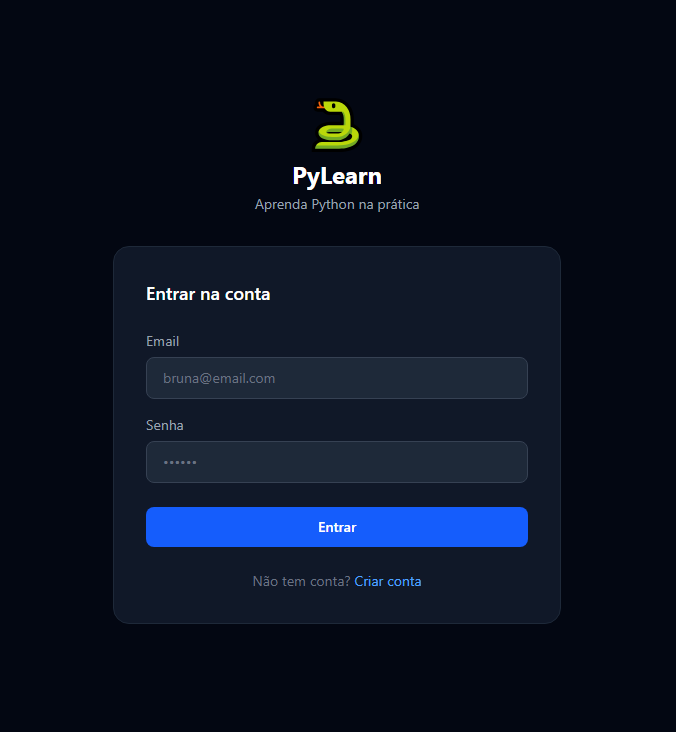
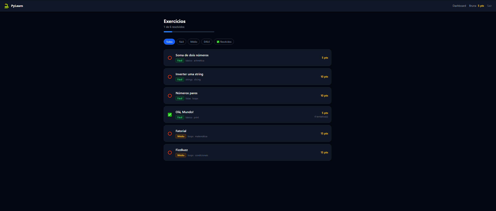
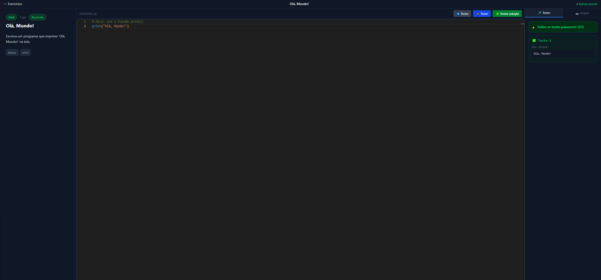
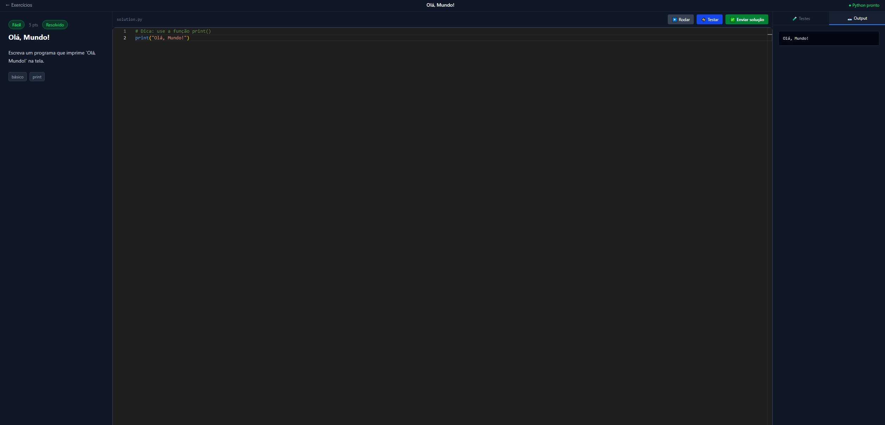
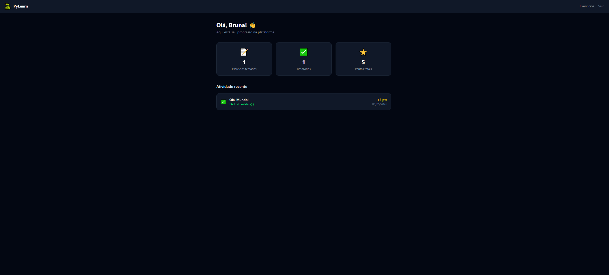

# 🐍 PyLearn — Interactive Python Learning Platform

A full-stack web application for learning Python through hands-on exercises with automatic feedback. Write code, run it directly in the browser, and get instant results — no setup required.

**🌐 Live Demo:** [cerulean-fairy-57ef67.netlify.app](https://cerulean-fairy-57ef67.netlify.app)

---

## Screenshots

<div align="center">
  <table>
    <tr>
      <td><b>Login</b></td>
      <td><b>Exercise List</b></td>
    </tr>
    <tr>
      <td></td>
      <td></td>
    </tr>
    <tr>
      <td><b>Code Editor + Test Results</b></td>
      <td><b>Output Tab</b></td>
    </tr>
    <tr>
      <td></td>
      <td></td>
    </tr>
    <tr>
      <td><b>Dashboard</b></td>
      <td></td>
    </tr>
    <tr>
      <td></td>
      <td></td>
    </tr>
  </table>
</div>

---

## Features

- 🐍 **In-browser Python execution** via Pyodide (WebAssembly) — no server-side code execution needed
- 📝 **Monaco Editor** — the same engine that powers VS Code, with syntax highlighting and autocomplete
- ✅ **Automatic test cases** — code is validated against expected outputs with instant feedback
- 🔐 **JWT Authentication** — secure register, login, and protected routes
- 📊 **Progress tracking** — points system, attempt history, and completion status per user
- 🏷️ **Difficulty levels** — Easy, Medium, and Hard exercises with tags
- 🌙 **Dark UI** built with Tailwind CSS

---

## Tech Stack

<div align="center">
  
### Frontend
| Technology | Purpose |
|---|---|
| React + Vite | UI framework and build tool |
| Tailwind CSS | Utility-first styling |
| Monaco Editor (`@monaco-editor/react`) | In-browser code editor |
| Pyodide | Python runtime via WebAssembly |
| Axios | HTTP client with JWT interceptors |
| React Router v6 | Client-side routing |

### Backend
| Technology | Purpose |
|---|---|
| Node.js + Express | REST API |
| MongoDB + Mongoose | Database and ODM |
| JSON Web Tokens (JWT) | Stateless authentication |
| bcryptjs | Secure password hashing |
| Joi | Request input validation |

### Infrastructure
| Service | Purpose |
|---|---|
| Netlify | Frontend hosting (CDN) |
| Railway | Backend hosting |
| MongoDB Atlas | Cloud database |
| GitHub | Version control |

</div>

---

## Architecture

```

┌──────────────────────────────────────────────┐
│                Browser (Client)              │
│                                              │
│   React App  ←────────→  Monaco Editor       │
│       │                       │              │
│   REST API              Pyodide (WASM)       │
│   (axios)            Python runs here!       │
└───────┬──────────────────────────────────────┘
        │ HTTPS
        ▼
┌──────────────────────────────────────────────┐
│          Node.js + Express (Railway)         │
│                                              │
│  /api/auth      → JWT register & login       │
│  /api/exercises → CRUD exercises             │
│  /api/progress  → Submit & track results     │
└───────┬──────────────────────────────────────┘
        │ Mongoose
        ▼
┌──────────────────────────────────────────────┐
│            MongoDB Atlas (Cloud)             │
│                                              │
│  users       exercises       progress        │
└──────────────────────────────────────────────┘

```

### How Python execution works

1. User writes Python code in the Monaco Editor
2. Pyodide (Python via WebAssembly) runs the code **entirely in the browser**
3. `stdout` is captured via a custom `OutputCapture` class
4. Output is compared against `expectedOutput` from the exercise
5. Test results are sent to the backend via `POST /api/progress/submit`
6. Progress is saved in MongoDB

> No Python server needed — execution is 100% client-side and secure.

---

## API Endpoints

### Auth
| Method | Route | Description | Auth |
|---|---|---|---|
| POST | `/api/auth/register` | Create account | ✗ |
| POST | `/api/auth/login` | Login | ✗ |
| GET | `/api/auth/me` | Get current user | ✓ |
| PATCH | `/api/auth/me` | Update profile | ✓ |

### Exercises
| Method | Route | Description | Auth |
|---|---|---|---|
| GET | `/api/exercises` | List with filters + pagination | ✗ |
| GET | `/api/exercises/:id` | Get exercise by ID | ✗ |
| POST | `/api/exercises` | Create exercise | ✓ |
| POST | `/api/exercises/seed` | Seed sample exercises | ✗ |

### Progress
| Method | Route | Description | Auth |
|---|---|---|---|
| POST | `/api/progress/submit` | Submit solution | ✓ |
| GET | `/api/progress` | Get user history + stats | ✓ |
| GET | `/api/progress/:exerciseId` | Check exercise status | ✓ |

---

## Getting Started (Local Development)

### Prerequisites
- Node.js 18+
- MongoDB Atlas account (free tier)

### 1. Clone the repository
```bash
git clone https://github.com/brunacarrassai/plataforma-python.git
cd plataforma-python
```

### 2. Setup the backend
```bash
cd backend
cp .env.example .env
# Fill in your MONGODB_URI and JWT_SECRET in .env
npm install
npm run dev
```

### 3. Setup the frontend
```bash
cd frontend
npm install
npm run dev
```

### 4. Seed the database with sample exercises
```bash
curl -X POST http://localhost:3001/api/exercises/seed
```

### 5. Open in browser
```
http://localhost:5173
```

### Environment variables (backend)
```env
MONGODB_URI=mongodb+srv://...
JWT_SECRET=your_secret_key
JWT_EXPIRES_IN=7d
PORT=3001
FRONTEND_URL=http://localhost:5173
NODE_ENV=development
```

---

## Project Structure

```
plataforma-python/
├── backend/
│   └── src/
│       ├── config/database.js
│       ├── models/          # User, Exercise, Progress
│       ├── routes/          # auth, exercises, progress
│       ├── middleware/       # auth (JWT), validate (Joi), errorHandler
│       ├── validators/       # Joi schemas
│       └── server.js
│
└── frontend/
    └── src/
        ├── context/          # AuthContext (global auth state)
        ├── hooks/            # usePyodide (Python execution)
        ├── components/       # CodeEditor, TestResults, ExerciseDescription
        ├── pages/            # Login, Register, Exercises, Solve, Dashboard
        ├── services/         # axios instance with JWT interceptors
        └── App.jsx           # Routes + PrivateRoute
```

---

## Roadmap

- [ ] Markdown rendering in exercise descriptions
- [ ] Improved UI/UX design
- [ ] Admin panel to create/edit exercises
- [ ] Leaderboard ranking
- [ ] More exercise categories (data structures, OOP, algorithms)
- [ ] Code execution time limit
- [ ] Hints system

---

## Author

Made by **Bruna Carrassai** as a full-stack development study project.

[](https://github.com/brunacarrassai/plataforma-python)
